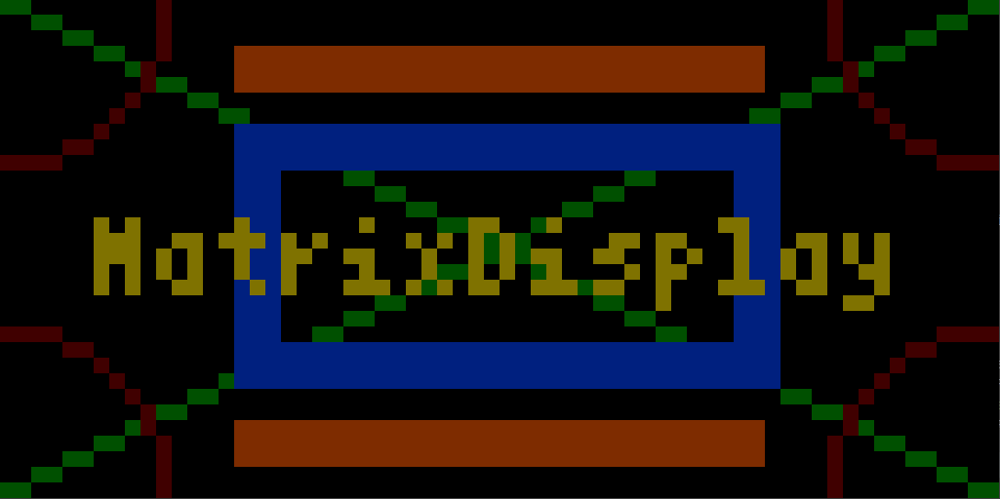
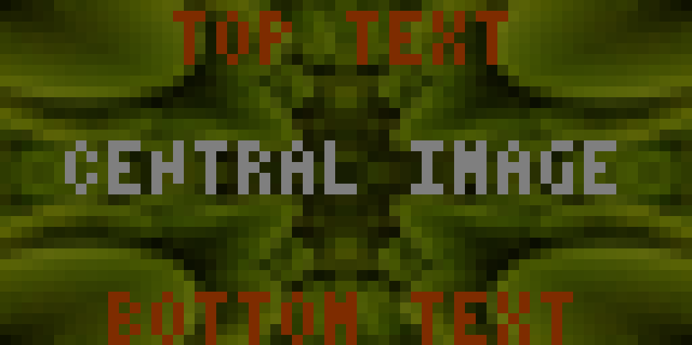
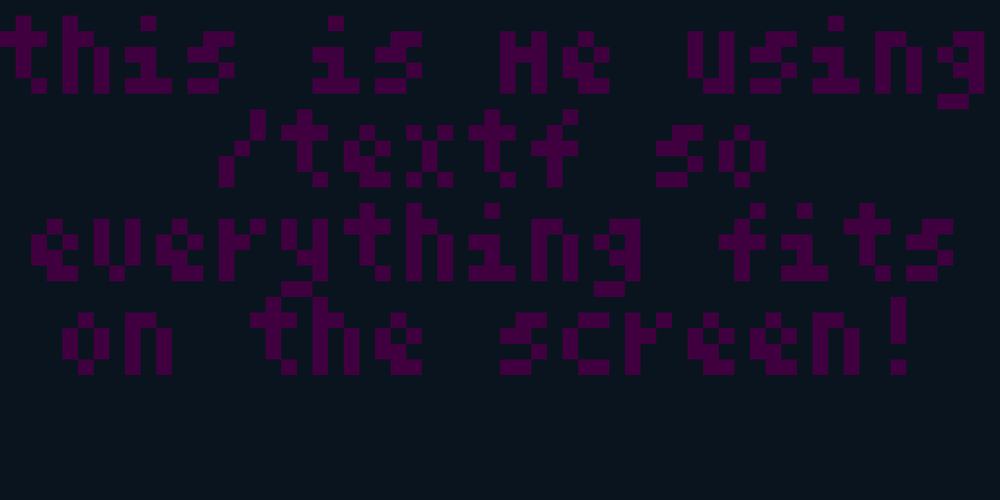
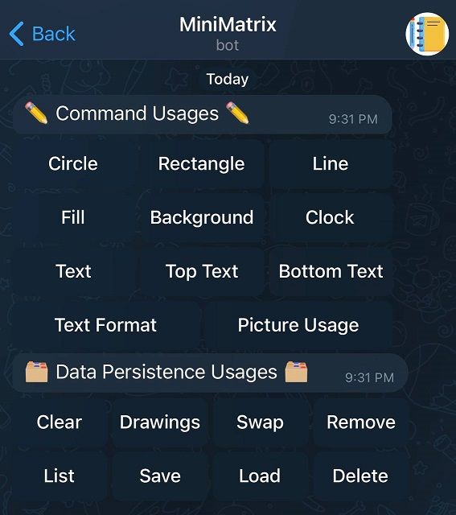

# Matrix Display

A driver Telegram bot for the rpi-rgb-led-matrix library

## Features
- Fully controllable using a telegram bot
- Allows you to use any of the shape drawing commands the base library offers
- Lets you save drawings and load them at a later date using a command
- Has a clock command to let you show the time
- Has an inline keyboard to show you command usages to find arguments easier

## Required Libraries
- [rpi-rgb-led-matrix](https://github.com/hzeller/rpi-rgb-led-matrix "rpi-rgb-led-matrix")
- [python-telegram-bot](https://github.com/python-telegram-bot/python-telegram-bot "python-telegram-bot")
- [pillow](https://pillow.readthedocs.io/en/stable/)


## Example Pictures








## Commands
#### How the colors work [color|(r,g,b)]
If you want to use one of the pre-defined colors, you can enter the name within brackets (example: [red])
*Predefined colors: red, orange, yellow, green, blue, purple, pink, white, gray, black, brown, night*

If you prefer to use an RGB value, put the values in parenthesis separated by a comma (example: (128,128,128))


#### /circle (x-pos) (y-pos) (radius) [color|(r,g,b)]
Adds a circle to the screen

Arguments:
x-pos: the center x-position of the circle
y-pos: the center y-position of the circle
color: the color of the circle


#### /rectangle (start-x) (start-y) (end-x) (end-y) (thickness) [color|(r,g,b)]
Adds a rectangle to the screen

Arguments:
start-x: the starting x-position of the rectangle
start-y: the starting y-position of the rectangle
end-x: the ending x-position of the rectangle
end-y: the ending y-position of the rectangle
thickness: the width of the rectangle
color: the color of the rectangle


#### /line (start-x) (start-y) (end-x) (end-y) [color|(r,g,b)]
Adds a line to the screen

Arguments:
start-x: the starting x-position of the line
start-y: the starting y-position of the line
end-x: the ending x-position of the line
end-y: the ending y-position of the line
color: the color of the line


#### /fill (start-x) (start-y) (end-x) (end-y) [color|(r,g,b)]
Fills an area on the screen

Arguments:
start-x: the starting x-position of the area 
start-y: the starting y-position of the area 
end-x: the ending x-position of the area 
end-y: the ending y-position of the area 
color: the color of the filled area 


#### /background [color|(r,g,b)]
Sets the background color of the matrix

Arguments:
color: the color of the background area


#### /clock (x-pos) (y-pos) (font-size) [color|(r,g,b)]
Adds a clock to the screen in 12-hour format with am or pm appended to the end

Arguments:
x-pos: the starting x position of the time object
y-pos: the starting y position of the time object
font-size: the font size of the time object *(must be a .bdf font embedded in the matrix library; please do not include .bdf at the end [example: 8x13B])*
color: the color of the text object


#### /text (x-pos) (y-pos) (font-size) [color|(r,g,b)] \<text>
Adds a line of text to the screen

Arguments:
x-pos: the starting x position of the text object *(you can also set it to -1 to center it on the screen)*
y-pos: the starting y position of the text object
font-size: the font of the text object
color: the color of the text object
text: the actual text for the object


#### /toptext (font-size) [color|(r,g,b)] \<text>
Adds a centered line of text to the top of the screen

Arguments:
font-size: the font of the text object
color: the color of the text object
text: the actual text for the object


#### /bottomtext (font-size) [color|(r,g,b)] \<text>
Adds a centered line of text to the bottom of the screen

Arguments:
font-size: the font of the text object
color: the color of the text object
text: the actual text for the object


#### /textf (font-size) [color|(r,g,b)] \<text>
Allows you to enter any text and it will automatically be split into separate lines so it fits on the screen. You can also use the pipe character | to manually override the lines you want the text to be on

Arguments:
font-size: the font of the text object
color: the color of the text object
text: the actual text for the object


#### /clear
Clears all the drawings on the screen


#### /drawings
Lists all the drawings on the screen into the telegram bot


#### /swap (drawing 1) (drawing 2)
Allows you to swap the order of two drawings so one is created before the other one
You can figure out what numbers to input by using the /drawings command

Arguments:
drawing 1: the first drawing
drawing 2: the drawing to swap with


#### /remove (drawing)
Allows you to remove a specific drawing from the screen
You can figure out what number to input using the /drawing command

Arguments:
drawing: the number of the drawing to remove


#### /save (drawing-name)
Saves the current state of the screen to a JSON file with the name of drawing-name

Arguments:
drawing-name: the name of the object to save


#### /load (drawing-name)
Loads the specified drawing from file onto the screen.

Arguments:
drawing-name: the name of the object to load


#### /list
Lists the drawings currently saved to file


#### /delete (drawing-name)
Deletes a drawing from file

Arguments:
drawing-name: the file to delete


#### /buttons
Loads the inline keyboard that you can use to figure out command usages from your phone. Also allows you to clear drawings or list drawings easier by using a button.

Telegram Interface:




## Running the Bot
### Setup
Before starting up the program, configure the following 5 lines of text at the top of matrix_main.py
```
MATRIX_WIDTH = 64
MATRIX_HEIGHT = 32

FONTS_FOLDER = "/home/pi/rpi-rgb-led-matrix/fonts"
DRAWINGS_FOLDER = "drawings"
BOT_API_KEY = "<your token here>"
```
MATRIX_WIDTH: the width of your matrix
MATRIX_HEIGHT: the height of your matrix
FONTS_FOLDER: where the fonts for the library are stored
DRAWINGS_FOLDER: the folder that will be created to store your drawings in
BOT_API_KEY: the API key for your telegram bot

### Starting the Bot
Ensure the required libraries are installed, make sure you finished the setup process, then run the main file:
```sudo python3 matrix_main.py```

